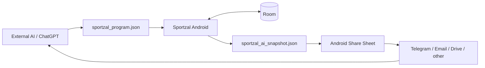

# Sportzal MVP — Architecture and UX Design

**Date:** 2026-09-06  
**Status:** Design approved in conversation; written spec pending final user review before implementation plan.  
**Repository:** `bimjim225-ship-it/sportzal`

## 1. Problem

The user trains approximately twice per week and wants a personal Android tool that is faster than a general-purpose fitness app.

The system must support an external AI coaching loop without embedding AI inside the app:

```text
AI creates plan → Android executes/logs → JSON export → AI analyzes → next plan
```

The app is intentionally single-user and does not need commercialization, accounts, backend infrastructure, a web dashboard, or cloud sync.

The strongest constraint is interaction cost in the gym: ordinary set logging must take roughly 3–5 seconds.

## 2. Product decision

### Chosen approach

Native Android:

- Kotlin;
- Jetpack Compose;
- Room;
- Kotlin serialization;
- Android Storage Access Framework / file intents;
- Android `FileProvider` + Share Sheet;
- no backend;
- no Firebase;
- no network dependency;
- no LLM API.

### Why

The app is Android-only, local-first, single-user, and small. Native Android removes unnecessary runtime/framework layers and provides direct access to lifecycle, file sharing, local storage and platform intents.

### Alternatives rejected

#### Firebase-first

Rejected for MVP because its only useful role would be transporting/backup of JSON. Android Share Sheet already solves transport to Telegram/email/Drive with substantially less code and no account/sync/error model.

#### PWA/Capacitor

Rejected because a web runtime provides no meaningful benefit for a personal Android-only logger and makes native file/open/share/lifecycle behavior less direct.

#### Embedded AI

Explicitly rejected. It would add API keys, network, cost, backend/security and duplicated decision logic. The AI already exists outside the app and is the authoritative interpreter.

## 3. Architectural boundary

Sportzal is a deterministic recorder and presenter.

Allowed responsibilities:

```text
DISPLAY
INPUT
TIMESTAMP
STORE
EXPORT
```

Forbidden responsibilities:

```text
ASSESS PROGRESS
ASSESS FATIGUE
SELECT NEXT LOAD
CHANGE PROGRAM
RECOMMEND REST
GENERATE TRAINING
```

The only computations that resemble analysis are mechanical UI computations such as elapsed time and list sorting from timestamps.

## 4. System context



There is no server between components.

## 5. Runtime architecture

Keep one Gradle app module in MVP. Do not create a multi-module architecture until actual scale requires it.

Suggested package boundaries:

```text
app/
  data/
    local/
      SportzalDatabase
      dao/
      entity/
    importexport/
      ProgramImporter
      ProgramValidator
      SnapshotExporter
      SnapshotShareCoordinator
    repository/
  model/
  ui/
    today/
    workout/
    history/
    equipment/
    components/
  navigation/
```

Dependency injection can use a small manual `AppContainer`. Hilt/Koin is not required for MVP.

## 6. Persistence

Room is the source of truth for structured app state.

Required logical tables/entities:

- `equipment`;
- `program`;
- `program_workout` / stored plan JSON or normalized plan entities;
- `workout`;
- `exercise_result`;
- `set_result`.

Implementation may normalize the program deeply or persist validated program JSON plus indexes for active views. Choose the simpler approach that preserves:

- immutable historical program versions;
- active workout plan snapshot;
- fast lookup of today's/next workout;
- reliable export.

### Important invariant

A started workout must never change when a new program is imported.

At start, persist a plan snapshot/reference sufficient to reconstruct exactly what was planned for that workout.

## 7. Time model

Every set records `completed_at` when the user taps `Записать подход`.

No persistent countdown timer is needed.

UI timer:

```text
elapsed = now - latest completed_at for this exercise in active workout
```

Consequences:

- backgrounding does not break timers;
- process death does not break timers;
- screen lock does not break timers;
- export contains stable raw timestamps;
- AI can recompute all intervals.

`completed_at` is not changed when a set is edited later. `edited_at` records the correction.

## 8. Workout model

Program → workouts → blocks → exercises → planned sets.

### Block mode `straight`

- exactly one exercise;
- sets are completed sequentially;
- elapsed timer is per exercise.

### Block mode `rotation`

- 2–N exercises;
- all unfinished exercise cards are visible;
- user alternates them until each reaches planned completion;
- user is never forced to select the top card.

### Rotation sort rule

For the active rotation block:

1. exercises with zero completed sets stay above started exercises and use `planned_order`;
2. started, unfinished exercises sort by descending elapsed time since their latest set;
3. completed/skipped exercises collapse below active content;
4. ties use `planned_order` for stability.

This is presentation only. UI must not label the top item as recommended/ready.

## 9. Set logging interaction

Target: 3–5 seconds.

Default card already contains values for the next set.

Prefill precedence:

1. previous actual set of the same exercise in current workout;
2. otherwise current planned set target.

User changes only what differs.

Typical interaction:

```text
[40 kg] [11 reps]
RIR [0][1][2][3][4+]   # only if required
[Записать подход]
```

After save:

- persist transaction;
- haptic acknowledgement;
- append compact set row;
- advance planned set cursor;
- new prefill;
- update timer;
- reorder rotation cards.

No modal success state.

## 10. RIR policy

RIR is valuable to external AI but must not become repetitive friction.

Exercise plan controls capture policy:

- `none`;
- `last_work_set`;
- `all_work_sets`.

UI bucket `4+` is serialized as `4` and documented as capped `>=4`.

## 11. Exceptions, not questionnaires

Normal technique/setup is assumed.

The overflow action allows optional facts:

- range shortened;
- technique changed;
- discomfort;
- setup changed;
- equipment changed;
- free note;
- skip exercise.

No field is mandatory in a normal set beyond the factual fields required by the plan.

## 12. Screens

### 12.1 Today

Priority:

1. resume active workout;
2. planned workout today;
3. next planned workout;
4. import program empty state.

Also exposes `Отправить последний JSON` after at least one workout exists.

### 12.2 Workout

Full-screen task surface.

- session elapsed time;
- active block;
- all exercise cards in that block;
- previews of later blocks;
- finish action.

Bottom navigation hidden.

### 12.3 Finish

Facts only:

- duration;
- work sets completed;
- exercises touched;
- whether planned work remains incomplete.

Primary CTA: `Отправить JSON`.

### 12.4 History

Simple list and detail. No charts, scores or progress interpretation.

### 12.5 Equipment

Simple catalog with name, setup hint and optional local photo.

### 12.6 Program import preview

Shows only enough to avoid importing the wrong file:

- program version;
- generated date;
- upcoming workout dates/titles;
- counts.

Then explicit `Импортировать`.

## 13. File roundtrip

### AI → phone

The user can transfer `sportzal_program.json` by Telegram/email/Drive/other means.

Sportzal supports:

- system file picker;
- Android `Open with Sportzal` for compatible JSON intents.

Import is transactional.

### Phone → AI

At finish or later from Today:

`Отправить JSON` → generate file → `ACTION_SEND` → Android Share Sheet.

No Telegram/email-specific SDK is needed.

This is the core reason Firebase/web is not part of MVP.

## 14. AI snapshot scope

Snapshot contains raw context, not app-generated conclusions:

- schema/app version;
- equipment catalog;
- active/current program;
- historical program versions referenced by included workouts;
- latest 24 workouts by start time;
- active workout if present.

At approximately two workouts per week, this provides around 12 weeks of raw history while remaining easy to send and upload to chat.

Snapshot can also serve as a practical off-device copy when the user sends it to their own Telegram/email/Drive.

## 15. Import/export contracts

Normative docs:

- `docs/data-contracts.md`;
- `docs/schemas/program.schema.json`;
- `docs/schemas/ai-snapshot.schema.json`.

Runtime code must not silently accept unsupported schema versions.

Program import validates structural invariants but never evaluates whether training choices are physiologically sensible.

## 16. Visual direction

Normative visual source: `DESIGN.md`.

North Star: instrument panel of sports equipment, not a generic fitness app.

Signature: stable right-side elapsed-time column inside exercise cards.

Primary qualities:

- glanceable;
- numeric;
- calm;
- one-handed;
- no motivational decoration;
- no analytics dashboard.

## 17. Offline and failure behavior

### App killed mid-workout

Reopen → detect active workout → Today primary CTA `Продолжить тренировку` → timestamps recover timers.

### Set save fails

Keep input in UI; show inline failure; retry. Do not advance set or timer until local transaction succeeds.

### Import invalid

No partial changes. Show exact reason and allow choosing another file.

### Share cancelled/fails

No data is lost. User can regenerate the snapshot later.

### New program imported during active workout

Current workout remains bound to its start-time program snapshot. New program applies only to future workouts.

## 18. Privacy and permissions

MVP should not request network permission solely for app functionality.

No account, analytics SDK or automatic upload is required.

File sharing is explicitly user initiated through Android OS.

Local equipment photos remain app-local and are not embedded in AI snapshot v1.

## 19. Non-goals

Do not implement in MVP:

- Firebase;
- web frontend;
- backend;
- LLM/API integration;
- auth;
- cloud sync;
- charts;
- progress scoring;
- workout recommendations;
- calorie tracking;
- wearable data;
- nutrition;
- social features;
- notifications;
- calendar integration;
- automatic machine recognition;
- full video technique analysis.

## 20. Verification strategy

Before claiming MVP ready:

### Unit

- rotation sorting;
- stable tie ordering;
- timestamp-derived elapsed values;
- RIR capture policy;
- program invariant validation;
- snapshot scope selection (latest 24 + active);
- serializers/deserializers.

### Database

- set atomic save;
- edit retains `completed_at`;
- active workout survives database reopen;
- imported program versions remain referentially available to history.

### Compose/instrumentation

- start workout;
- record a normal set quickly;
- rotation reorders without losing input/focus;
- resume after activity/process recreation;
- finish incomplete workout confirmation;
- import preview and invalid import;
- history detail;
- local photo binding.

### Platform/device

- share generated JSON to at least one generic target through Android chooser;
- receive/open a JSON file from another app;
- app usable with no network;
- font scale 200% smoke;
- TalkBack smoke;
- narrow phone layout.

## 21. Implementation sequencing after spec approval

The implementation plan should be generated only after this written spec is reviewed.

Expected order at a high level:

1. Android project shell + theme + persistence skeleton;
2. data contracts/models/import tests;
3. Today + program import;
4. workout state + timestamp persistence;
5. straight block;
6. rotation sorting;
7. set edit/deviations;
8. finish + snapshot export/share;
9. history/equipment;
10. resilience/accessibility/device verification.

This section is sequencing intent, not an implementation plan; detailed tasks belong to the Superpowers writing-plans phase after user review.
